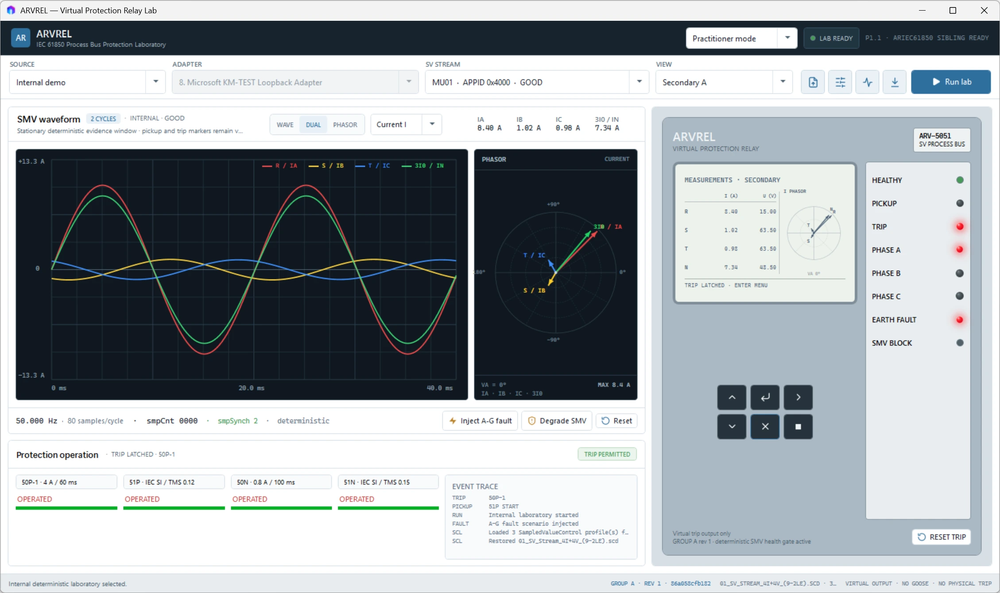

<div align="center">

# ARVREL

### Virtual Protection Relay Laboratory for IEC 61850 Sampled Values

**Turn process-bus data into trusted measurements, virtual protection decisions, and reviewable engineering evidence.**

[](https://github.com/masarray/arvrel/actions/workflows/dotnet.yml)
[](https://github.com/masarray/arvrel/releases)
[](LICENSE)
[](#current-public-status)
[](#engineering-and-safety-boundary)

[Product site](https://masarray.github.io/arvrel/) · [Download and verify](https://masarray.github.io/arvrel/download.html) · [Evaluate in five minutes](https://masarray.github.io/arvrel/quick-start.html) · [Documentation](#documentation) · [Release notes](RELEASE-NOTES.md)

</div>



## Why ARVREL

ARVREL makes the complete protection cause-and-effect chain visible in one vendor-neutral Windows workspace.

| Observe | Evaluate | Prove |
|---|---|---|
| Inspect live or replayed Sampled Values, stream identity, continuity, quality, mapping, scaling, waveform, phasors, and sequence quantities. | Apply configurable protection settings and review pickup, timing, directional decisions, blocking, operation, and the virtual trip latch. | Preserve active settings identity, SMV trust state, pickup and trip timestamps, operating quantity, trip cause, event trace, and exportable evidence. |

ARVREL is designed for protection engineers, substation-automation engineers, process-bus integration teams, FAT/SAT preparation, university laboratories, and reproducible protection-algorithm research.

## Current public status

| Item | Status |
|---|---|
| Current version | `v0.1.0-beta.1` |
| Product maturity | Public engineering beta |
| Supported platform | Windows 10/11 x64 |
| Official packages | Self-contained installer and portable ZIP |
| Live process bus | Npcap required separately |
| Output authority | Virtual output only |
| Intended use | Education, source review, controlled laboratory evaluation, FAT/SAT preparation, and research |

The beta is not presented as a certified protection IED, calibrated relay test set, IEC 61850 conformance result, or deterministic hard-real-time trip platform.

## What you can do

- capture IEC 61850 Sampled Values through Npcap or replay PCAP/PCAPNG files;
- import SCL and evaluate APPID, destination MAC, VLAN, `svID`, `datSet`, `confRev`, mapping, scaling, quality, freshness, and `smpCnt` evidence;
- inspect 4I+4V one-cycle RMS phasors, symmetrical components, residual quantities, and complete two-cycle waveform windows;
- configure native protection settings with familiar practitioner notation, setting groups, revisions, presets, and SHA-256 fingerprints;
- evaluate virtual 50P-1, 51P, 50N, 51N, 67P, 67N, 27, 59, and 59N elements;
- review pickup timing, operated-element attribution, latched phase/earth causes, operating quantities, and exported evidence;
- inspect the exact active standard algorithm source while keeping editable research source shadow-only;
- hold the last coherent waveform and phasor evidence while an unhealthy live stream recovers.

## Protection coverage

| ANSI | Function | Public-beta implementation | Boundary |
|---|---|---|---|
| 50P-1 | Instantaneous phase overcurrent | Pickup, dropout, definite delay | Virtual operation only |
| 51P | Time phase overcurrent | IEC inverse, definite time, TMS, reset modes | No IEC 60255 type-test claim |
| 50N | Instantaneous earth fault | Explicit IN/3I0 preferred, calculated residual fallback | Virtual operation only |
| 51N | Time earth fault | IEC inverse, definite time, TMS, reset modes | No IEC 60255 type-test claim |
| 67P | Directional phase overcurrent | Positive-sequence V1/I1 polarization | No memory polarization |
| 67N | Directional earth fault | Residual 3V0/3I0 polarization | Negative-sequence and memory polarization deferred |
| 27 | Undervoltage | Phase-neutral, phase-phase, or V1; 1/2/3-of-3 logic | Measurement provenance remains trust-gated |
| 59 | Overvoltage | Phase-neutral, phase-phase, or V1; 1/2/3-of-3 logic | Measurement provenance remains trust-gated |
| 59N | Residual overvoltage | 3V0 magnitude and definite delay | Virtual operation only |

Feeder elements default to disabled until explicitly configured by the operator.

## Trust before trip

ARVREL separates visibility from authority. A stream can remain inspectable while communication or configuration evidence removes permission for a new virtual trip.

```text
AllowsMeasurement  → quantities may enter the measurement and display pipeline
AllowsPickup       → protection pickup and timing may be evaluated
AllowsTrip         → an operated element may assert the virtual trip latch
```

The trust pipeline evaluates complete measurement windows, live freshness, payload decode, `smpCnt` continuity, quality words, mapping, scaling provenance, SCL binding, address identity, `svID`, dataset, and `confRev` consistency.

Rejected duplicate and out-of-order frames remain visible in telemetry but their payload samples do not enter RMS, waveform, phasor, or protection buffers.

## Five-minute evaluation

### Use an official Windows package

This is the recommended path for first-time evaluation. The packaged application already includes the compiled ARIEC61850 engine dependency.

1. Download the Windows installer or portable ZIP from [GitHub Releases](https://github.com/masarray/arvrel/releases).
2. Launch ARVREL and select **Internal demo**.
3. Open **Relay settings** and **CT/VT context**.
4. Use **Inject A-G fault**.
5. Review the trust state, waveform, phasors, relay LCD, pickup/trip indication, event trace, and operation evidence.
6. Install Npcap separately only when authorized live Sampled Values capture is required.

### Build from source

Source development uses ARVREL beside the sibling ARIEC61850 repository.

Requirements: Windows 10/11 x64, .NET 8 SDK, Git, and Npcap for live capture.

```text
C:\Git\
├── ARIEC61850\
└── arvrel\
```

```powershell
cd C:\Git\arvrel
.\scripts\verify-sibling.cmd
.\scripts\build.cmd
.\scripts\run.cmd
```

Run deterministic tests:

```powershell
dotnet test .\tests\Arvrel.Protection.Tests\Arvrel.Protection.Tests.csproj -c Release
dotnet test .\tests\Arvrel.ProcessBus.Tests\Arvrel.ProcessBus.Tests.csproj -c Release
```

See [Windows build and run](docs/WINDOWS_SETUP.md) for execution-policy-safe commands and troubleshooting.

## Architecture at a glance

```text
Internal deterministic source / Live Npcap / PCAP replay
                         │
                         ▼
              ARIEC61850 parse + SCL model
                         │
                         ▼
     continuity · mapping · scaling · quality · trust gates
                         │
              ┌──────────┴──────────┐
              ▼                     ▼
      one-cycle measurement    two-cycle evidence
      RMS + phasors            waveform + coherent hold
              │                     │
              ▼                     ▼
      protection engine        WPF operator workspace
              │
              ▼
  virtual trip latch · operation record · evidence export
```

Protection evaluation occurs when decoded measurements arrive, not when WPF renders. Mutable per-stream runtime state is protected independently and exposed to the UI through immutable snapshots.

See [Architecture](docs/ARCHITECTURE.md) and [P2 multifunction feeder protection](docs/P2_MULTIFUNCTION_FEEDER.md).

## Documentation

| Public product routes | Engineering detail | Project governance |
|---|---|---|
| [Capabilities](https://masarray.github.io/arvrel/capabilities.html) | [Architecture notes](docs/ARCHITECTURE.md) | [Contributing](CONTRIBUTING.md) |
| [Engineering workflows](https://masarray.github.io/arvrel/workflows/) | [Multifunction feeder protection](docs/P2_MULTIFUNCTION_FEEDER.md) | [Security](SECURITY.md) |
| [Evidence and trust](https://masarray.github.io/arvrel/evidence-and-trust.html) | [Dual practitioner/research modes](docs/P1_1_DUAL_MODE.md) | [Support](SUPPORT.md) |
| [Safety and limitations](https://masarray.github.io/arvrel/safety-and-limitations.html) | [Windows setup](docs/WINDOWS_SETUP.md) | [Code of conduct](CODE_OF_CONDUCT.md) |
| [Download and verify](https://masarray.github.io/arvrel/download.html) | [Product requirements](docs/PRD.md) | [Third-party notices](THIRD-PARTY-NOTICES.md) |

## Engineering and safety boundary

ARVREL's standard public build is **virtual-output laboratory software**. It does not provide:

- physical relay contacts;
- operational GOOSE trip;
- MMS control;
- autonomous switching;
- switching authority or interlocking approval;
- IEC 61850 conformance certification;
- IEC 60255 type-test or calibration evidence;
- deterministic hard-real-time guarantees.

Use live capture only on isolated, authorized laboratory networks. Do not use ARVREL as the sole basis for operational protection settings, commissioning acceptance, or switching decisions.

## Known beta limitations

- unsigned community binaries may trigger Windows reputation warnings;
- live behavior depends on Windows scheduling, Npcap, adapter drivers, publisher behavior, adapter quality, and host load;
- 46, 47, 49, 81U/O, 32, 37, 50BF, 79, 25, 86, 74TCS, and 60 are not implemented;
- negative-sequence and memory polarization for 67N are deferred;
- broad clean-machine, multi-adapter, long-duration, and field-environment validation continues.

## Evidence, privacy, and release integrity

ARVREL stores local preferences and diagnostics under `%LOCALAPPDATA%\ARVREL`. Do not publish customer captures, proprietary station SCL files, credentials, IP plans, or employer-confidential information. Use synthetic or contributor-owned fixtures.

Official releases are produced by GitHub Actions and include, when available:

- self-contained Windows x64 installer;
- self-contained portable ZIP;
- SHA-256 checksums;
- NuGet transitive dependency report;
- CycloneDX SBOM;
- build and engine commit metadata;
- GPL, commercial-licensing, security, support, and third-party notices.

## Licensing

ARVREL source is licensed under **GPL-3.0-or-later**. GPL permits commercial use when its obligations are followed.

A separate commercial license may be negotiated for proprietary redistribution, closed-source integration, OEM deployment, contractual support, or other agreed terms. See [Commercial licensing](COMMERCIAL-LICENSING.md).

Third-party components retain their own licenses. See [Third-party notices](THIRD-PARTY-NOTICES.md).

## Citation

Research and teaching publications may cite the versioned software metadata in [CITATION.cff](CITATION.cff).

---

<div align="center">

**See the stream. Evaluate the protection. Preserve the evidence.**

</div>
